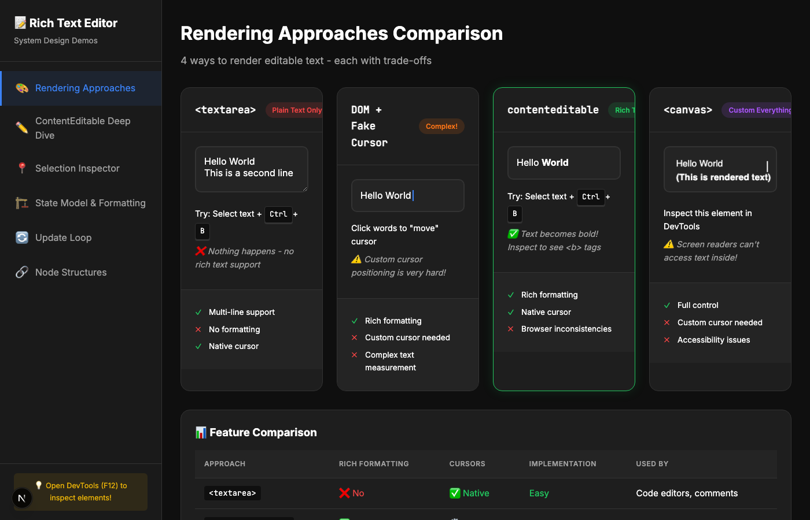
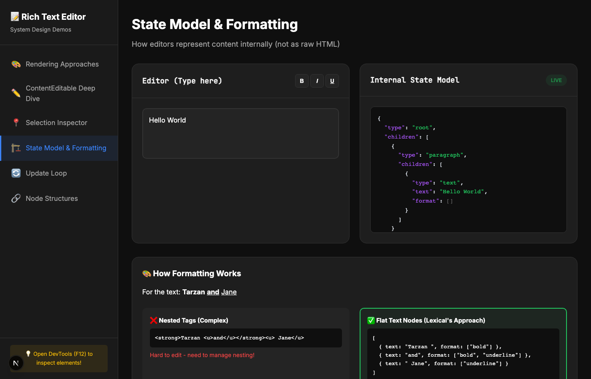
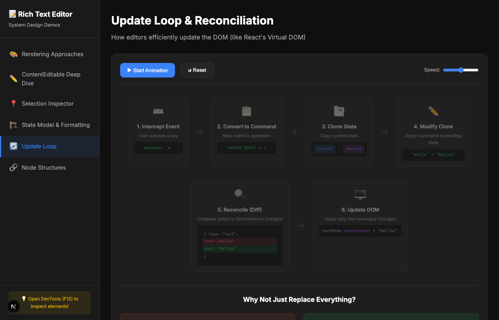
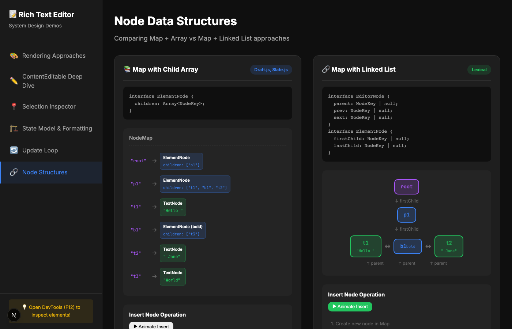

<p align="center">
  
</p>

<h1 align="center">Rich Text Editor — System Design</h1>

<p align="center">
  <strong>Interactive visual demos that explain how rich text editors work under the hood</strong>
</p>

<p align="center">
  <a href="#demos">Demos</a> •
  <a href="#why-this-exists">Why This Exists</a> •
  <a href="#tech-stack">Tech Stack</a> •
  <a href="#getting-started">Getting Started</a> •
  <a href="#project-structure">Project Structure</a>
</p>

<p align="center">
  
  
  
  
</p>

---

## Why This Exists

Ever wondered what happens when you press a key in Google Docs, Notion, or Slack? How does **Lexical**, **Slate**, or **Draft.js** turn keystrokes into styled, structured content?

This project is a **hands-on teaching tool** built for a frontend system design session. Instead of slides, every concept is an interactive demo you can touch, break, and inspect.

It covers the 6 core building blocks that power every modern rich text editor:

| # | Topic | What You'll Learn |
|---|-------|-------------------|
| 1 | Rendering Approaches | Why `contentEditable` beats `<textarea>`, `<canvas>`, and fake cursors |
| 2 | ContentEditable | How the browser's native rich text API works (and where it breaks) |
| 3 | Selection API | Anchor, focus, direction — the browser primitives editors rely on |
| 4 | State Model | Why editors use structured JSON state instead of raw HTML |
| 5 | Update Loop | Event → Command → Clone → Modify → Diff → Patch (just like React!) |
| 6 | Node Structures | Map + Array (Draft.js) vs Map + Linked List (Lexical) |

---

## Demos

### 1. Rendering Approaches Comparison

Compare 4 ways to render editable text — `<textarea>`, DOM + Fake Cursor, `contentEditable`, and `<canvas>` — each with live, interactive examples and a side-by-side feature comparison table.


---

### 2. ContentEditable Deep Dive

Type, format (`Ctrl+B/I/U`), and watch the live DOM output update in real-time. Includes a text node quiz and a cursor behavior demo across different text sizes.


---

### 3. Selection Inspector

A live, real-time view of the browser's `Selection` object — `anchorNode`, `focusNode`, offsets, and direction. One-click demos for backwards and cross-node selections.


---

### 4. State Model & Formatting

Type in the editor and see the content parsed into a Lexical-style JSON state model in real-time. Demonstrates why flat text nodes with format arrays beat nested HTML tags.



---

### 5. Update Loop & Reconciliation

An animated, step-by-step walkthrough of the editor update loop: intercept → command → clone → modify → reconcile → patch. Adjustable speed with play/pause controls. Shows why reconciliation beats naive `innerHTML` replacement.



---

### 6. Node Data Structures

Side-by-side animated comparison of **Map + Array** (Draft.js, Slate) vs **Map + Linked List** (Lexical). Watch array index shifting vs O(1) pointer updates in real time, with a full complexity comparison table.



---

## Tech Stack

| Tool | Purpose |
|------|---------|
| [Next.js 16](https://nextjs.org/) | React framework with App Router |
| [React 19](https://react.dev/) | UI library |
| [TypeScript 5](https://www.typescriptlang.org/) | Type safety |
| [Tailwind CSS 4](https://tailwindcss.com/) | Utility-first CSS (with custom CSS variables) |

Zero external UI libraries. Every demo, animation, and visualization is built from scratch with plain React, CSS, and browser APIs.

---

## Getting Started

```bash
# Clone the repository
git clone https://github.com/sagarsehwag/rich-text-editor-system-design.git
cd rich-text-editor-system-design

# Install dependencies
npm install

# Start the dev server
npm run dev
```

Open [http://localhost:3000](http://localhost:3000) and explore the demos using the sidebar navigation.

---

## Project Structure

```
app/
├── components/
│   ├── layout/
│   │   └── Sidebar.tsx              # Sidebar navigation with 6 demo sections
│   └── demos/
│       ├── RenderingApproaches.tsx   # textarea vs DOM vs contentEditable vs canvas
│       ├── ContentEditableDemo.tsx   # Native formatting, DOM output, text nodes
│       ├── SelectionInspector.tsx    # Live Selection API visualization
│       ├── StateModel.tsx           # JSON state model with formatting
│       ├── UpdateLoop.tsx           # Animated update loop flowchart
│       └── NodeStructures.tsx       # Array vs Linked List comparison
├── globals.css                      # Dark theme, all component styles
├── layout.tsx                       # Root layout with metadata
└── page.tsx                         # Client-side routing between demos
```

---

## References & Inspiration

These demos are informed by the internals of:

- [**Lexical**](https://lexical.dev/) — Meta's extensible text editor framework (linked list node model, reconciliation)
- [**Slate**](https://docs.slatejs.org/) — A customizable framework for building rich text editors (array-based children)
- [**Draft.js**](https://draftjs.org/) — Meta's legacy rich text editor (ContentState, entity maps)
- [**ProseMirror**](https://prosemirror.net/) — Marijn Haverbeke's toolkit for building editors
- [**Google Docs**](https://docs.google.com/) — Canvas-based rendering approach

---

## License

MIT

---

<p align="center">
  Built with care for frontend system design interviews and deep dives.<br/>
  <strong>Star the repo if you found it useful!</strong>
</p>
